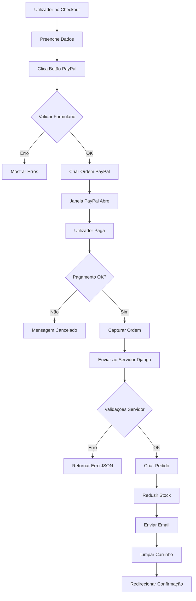

# Sistema de Pagamento PayPal - Documentação Completa

## Visão Geral
Sistema completo de pagamento via PayPal JavaScript SDK integrado ao checkout do projeto "Cantos de Papel". Implementa fluxo seguro de pagamento com validações do lado do servidor, criação automática de pedidos e gestão de stock.

## Componentes Implementados

### 1. Template de Checkout (`checkout.html`)

#### Integração PayPal SDK
```html
<script src="https://www.paypal.com/sdk/js?client-id=SEU_CLIENT_ID&currency=EUR&locale=pt_PT"></script>
```

**Parâmetros:**
- `client-id`: ID do cliente PayPal (Sandbox para testes)
- `currency=EUR`: Moeda em Euros
- `locale=pt_PT`: Idioma Português de Portugal

#### Container do Botão PayPal
```html
<div id="paypal-button-container"></div>
```

O botão é renderizado dinamicamente pelo SDK do PayPal com estilo personalizado.

#### Elementos Visuais
- **Box de Informação**: Explica que é pagamento seguro via PayPal
- **Indicador de Processamento**: Spinner animado durante transação
- **Mensagens de Erro**: Alertas em PT-PT para erros de validação

### 2. JavaScript de Integração

#### Validação de Formulário
```javascript
function validarFormulario() {
    // Valida todos os campos obrigatórios
    // Valida formato de email
    // Destaca campos com erro em vermelho
    // Retorna array de erros
}
```

**Campos Validados:**
- Nome completo
- Email (com regex)
- Telefone
- Morada
- Cidade
- Código postal

#### Criação da Ordem PayPal
```javascript
createOrder: function(data, actions) {
    // 1. Validar formulário
    // 2. Calcular totais (subtotal, IVA, desconto)
    // 3. Preparar itens do carrinho
    // 4. Criar ordem no PayPal
}
```

**Estrutura da Ordem:**
```json
{
  "purchase_units": [{
    "description": "Livros - Cantos de Papel",
    "amount": {
      "currency_code": "EUR",
      "value": "45.50",
      "breakdown": {
        "item_total": {"value": "37.00"},
        "tax_total": {"value": "8.50"},
        "discount": {"value": "0.00"}
      }
    },
    "items": [...]
  }],
  "application_context": {
    "shipping_preference": "NO_SHIPPING",
    "brand_name": "Cantos de Papel",
    "locale": "pt-PT"
  }
}
```

#### Captura do Pagamento
```javascript
onApprove: function(data, actions) {
    // 1. Mostrar indicador de processamento
    // 2. Capturar ordem no PayPal
    // 3. Enviar dados ao servidor Django
    // 4. Limpar carrinho
    // 5. Redirecionar para confirmação
}
```

### 3. Vista Django (`processar_pagamento_paypal`)

#### Endpoint
```
POST /processar-pagamento-paypal/
```

#### Parâmetros Recebidos

**Dados PayPal:**
- `paypal_order_id`: ID da transação PayPal
- `paypal_payer_id`: ID do pagador
- `paypal_payer_email`: Email do pagador
- `paypal_status`: Status da transação (deve ser "COMPLETED")
- `paypal_amount`: Valor pago

**Dados do Formulário:**
- `nome_completo`
- `email`
- `telefone`
- `morada`
- `cidade`
- `codigo_postal`
- `pais`
- `notas` (opcional)

**Dados do Carrinho:**
- `carrinho_data`: JSON com itens do carrinho
- `cupom_codigo`: Código do cupom (opcional)

#### Fluxo de Validação

```python
1. Verificar método HTTP (POST)
2. Validar dados obrigatórios PayPal
3. Verificar status = "COMPLETED"
4. Validar carrinho não vazio
5. Validar campos de envio
6. Verificar stock disponível para cada item
7. Calcular totais (subtotal, IVA, desconto)
8. VALIDAÇÃO CRÍTICA: Comparar valor pago com total calculado
9. Criar pedido se todas as validações passarem
10. Reduzir stock e incrementar vendas
11. Enviar email de confirmação
12. Retornar sucesso em JSON
```

#### Validações de Segurança

**1. Validação de Valores (Anti-Manipulação)**
```python
paypal_amount_decimal = Decimal(paypal_amount)
if abs(paypal_amount_decimal - total) > Decimal('0.01'):
    return JsonResponse({
        'success': False,
        'mensagem': 'Valor pago não coincide com total. Possível manipulação.'
    }, status=400)
```

**Tolerância:** 1 cêntimo para arredondamentos

**2. Verificação de Stock**
```python
if not livro.em_stock() or livro.stock < quantidade:
    return JsonResponse({
        'success': False,
        'mensagem': f'Stock insuficiente para: {livro.titulo}'
    }, status=400)
```

**3. Validação de Status PayPal**
```python
if paypal_status != 'COMPLETED':
    return JsonResponse({
        'success': False,
        'mensagem': f'Pagamento não concluído. Status: {paypal_status}'
    }, status=400)
```

### 4. Criação do Pedido

#### Objeto Pedido
```python
Pedido.objects.create(
    utilizador=request.user,
    status='processando',  # Status após pagamento confirmado
    subtotal=subtotal,
    iva=iva,
    total=total,
    cupom=cupom_obj,
    desconto_cupom=desconto_cupom,
    nome_completo=nome_completo,
    email=email,
    telefone=telefone,
    morada=morada,
    cidade=cidade,
    codigo_postal=codigo_postal,
    pais=pais,
    notas=f"{notas}\n\nPagamento PayPal\nID: {paypal_order_id}"
)
```

#### Gestão de Stock
```python
# Para cada item do pedido:
livro.stock -= quantidade          # Reduz stock
livro.vendas_totais += quantidade  # Incrementa vendas
livro.save()
```

### 5. Respostas da API

#### Sucesso
```json
{
  "success": true,
  "mensagem": "Pedido criado com sucesso",
  "pedido_id": 123
}
```

#### Erro de Validação
```json
{
  "success": false,
  "mensagem": "Stock insuficiente para: Harry Potter"
}
```

#### Erro de Segurança
```json
{
  "success": false,
  "mensagem": "O valor pago (45.50€) não coincide com o total do pedido (50.00€)"
}
```

## Configuração do Ambiente

### Modo Sandbox (Teste)

#### 1. Criar Conta Sandbox PayPal
1. Acesse: https://developer.paypal.com/
2. Login com conta PayPal
3. Vá para Dashboard > Sandbox > Accounts
4. Crie conta de teste (comprador e vendedor)

#### 2. Obter Credenciais
1. Dashboard > My Apps & Credentials
2. Sandbox (não Live)
3. Copie o **Client ID**
4. Substitua no template checkout.html:

```javascript
// Substituir esta linha:
<script src="https://www.paypal.com/sdk/js?client-id=SEU_CLIENT_ID&currency=EUR&locale=pt_PT"></script>

// Por:
<script src="https://www.paypal.com/sdk/js?client-id=AZxxxx...&currency=EUR&locale=pt_PT"></script>
```

#### 3. Contas de Teste

**Comprador (Buyer):**
- Email: sb-buyer123@personal.example.com
- Senha: (gerada pelo PayPal)
- Tipo: Personal Account

**Vendedor (Seller):**
- Email: sb-seller456@business.example.com
- Senha: (gerada pelo PayPal)
- Tipo: Business Account

### Modo Produção (Live)

⚠️ **ANTES DE IR PARA PRODUÇÃO:**

1. Obtenha Client ID de produção
2. Substitua o Client ID sandbox
3. Remova a mensagem de "Ambiente de teste"
4. Configure webhook para notificações
5. Implemente logging robusto
6. Configure SSL/HTTPS

## Fluxo Completo de Pagamento



## Mensagens em PT-PT

### Interface
- "Pagamento seguro via PayPal"
- "Ambiente de teste (Sandbox) - Use dados de teste do PayPal"
- "A processar pagamento..."
- "Complete os dados de envio e clique no botão PayPal"

### Erros
- "Por favor, corrija os seguintes erros:"
- "Campo obrigatório: nome completo"
- "Email inválido"
- "O carrinho está vazio"
- "Stock insuficiente para: [título]"
- "Pagamento cancelado. Pode tentar novamente quando desejar."
- "Ocorreu um erro ao processar o pagamento"

### Sucesso
- "Pedido criado com sucesso"
- "Cupom aplicado com sucesso!"

## Testes Recomendados

### 1. Testes Funcionais

#### Pagamento Bem-Sucedido
```
1. Adicionar livros ao carrinho
2. Ir para checkout
3. Preencher dados de envio
4. Clicar botão PayPal
5. Login com conta sandbox comprador
6. Confirmar pagamento
7. Verificar:
   - Pedido criado na base de dados
   - Stock reduzido
   - Carrinho limpo
   - Email enviado
   - Redirecionamento para confirmação
```

#### Validação de Formulário
```
1. Ir para checkout
2. Deixar campos vazios
3. Clicar PayPal
4. Verificar mensagens de erro
5. Campos destacados em vermelho
```

#### Validação de Stock
```
1. Livro com stock = 1
2. Adicionar 2 unidades ao carrinho
3. Tentar finalizar
4. Verificar erro "Stock insuficiente"
```

#### Cupom de Desconto
```
1. Aplicar cupom válido
2. Verificar desconto aplicado
3. Pagar via PayPal
4. Verificar total correto pago
5. Verificar desconto registado no pedido
```

### 2. Testes de Segurança

#### Manipulação de Preços
```python
# Simular alteração de preço no cliente
# JavaScript Console:
localStorage.setItem('carrinho', JSON.stringify([
    {id: 1, preco: 0.01, quantidade: 1}  // Preço manipulado
]))

# Resultado esperado:
# Erro: "Valor pago não coincide com total"
```

#### Status PayPal Inválido
```python
# Modificar request no servidor
# Enviar status = "PENDING" em vez de "COMPLETED"

# Resultado esperado:
# Erro: "Pagamento não concluído"
```

### 3. Testes de Carga

```python
# Teste de múltiplos pedidos simultâneos
# Verificar locks de transação no stock
# Prevenir overselling (vender mais que stock disponível)
```

## Troubleshooting

### Problema: Botão PayPal não aparece
**Causa:** Client ID inválido ou erro de rede
**Solução:** 
- Verificar Client ID no console do navegador
- Verificar se SDK carregou (Network tab)
- Testar URL direta do SDK

### Problema: "Erro ao processar pagamento"
**Causa:** Validação falhou no servidor
**Solução:**
- Verificar logs do Django
- Verificar dados enviados no Network tab
- Confirmar stock disponível

### Problema: Email não enviado
**Causa:** Configuração SMTP
**Solução:**
- Email não é crítico, pedido ainda é criado
- Verificar settings.py EMAIL_*
- Configurar backend console para testes

### Problema: Carrinho não limpa após pagamento
**Causa:** JavaScript não executou
**Solução:**
- Verificar console do navegador
- Confirmar redirecionamento ocorreu
- Limpar localStorage manualmente para teste

## Melhorias Futuras

1. **Webhook PayPal**: Receber notificações automáticas de status
2. **Reembolsos**: Interface para processar devoluções
3. **Pagamento Recorrente**: Assinaturas mensais
4. **Múltiplas Moedas**: Suporte para USD, GBP, etc.
5. **Salvamento de Pagamento**: PayPal Vault para clientes recorrentes
6. **Analytics**: Rastreamento de conversão e abandono
7. **A/B Testing**: Otimizar taxa de conversão
8. **Proteção ao Vendedor**: Integrar com sistema de tracking

## Documentação Adicional

- [PayPal JavaScript SDK](https://developer.paypal.com/sdk/js/)
- [Orders API v2](https://developer.paypal.com/docs/api/orders/v2/)
- [Sandbox Testing Guide](https://developer.paypal.com/docs/api-basics/sandbox/)

---

**Status**: ✅ Implementado e Funcional  
**Ambiente**: Sandbox (Teste)  
**Idioma**: PT-PT  
**Última Atualização**: 4 de janeiro de 2026
